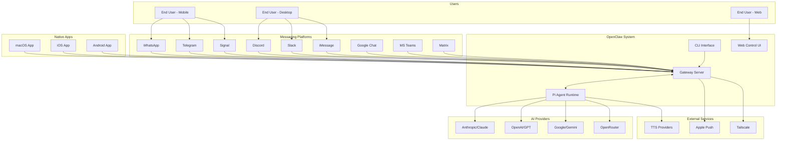
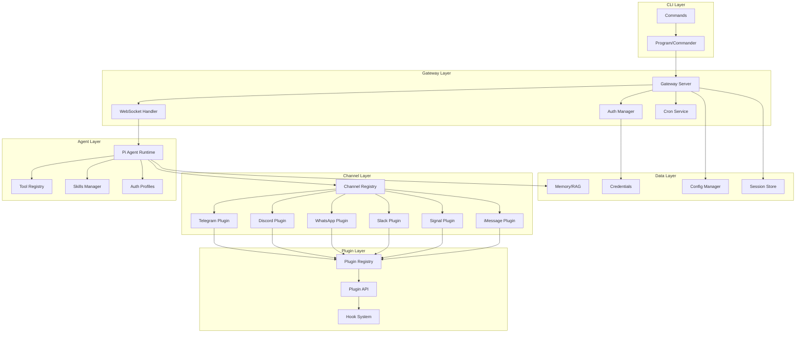
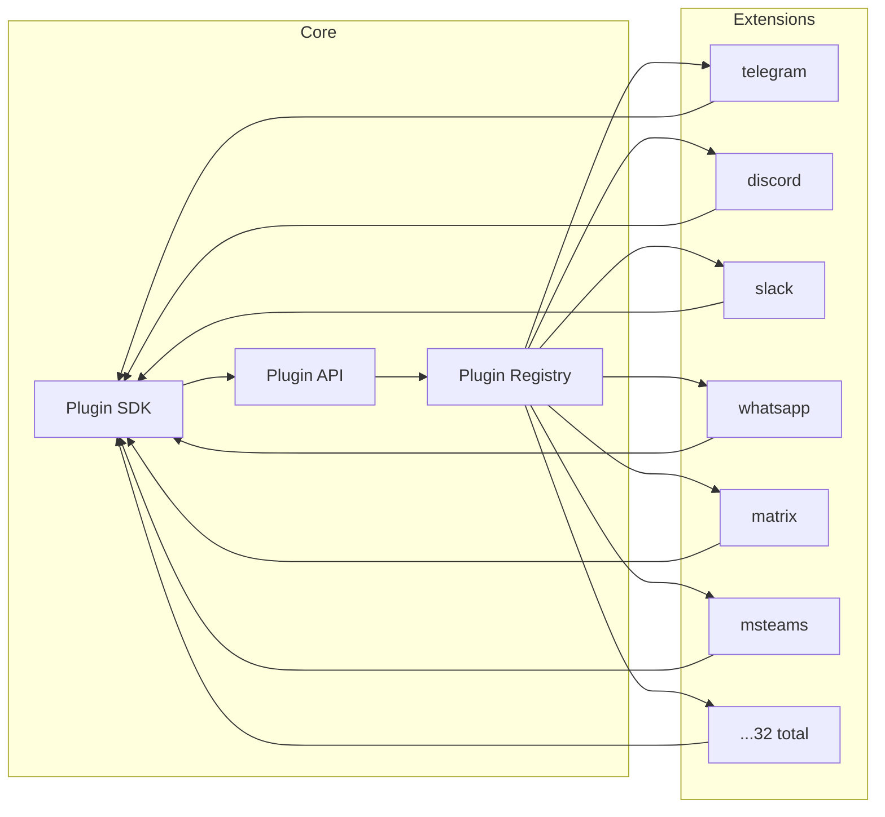
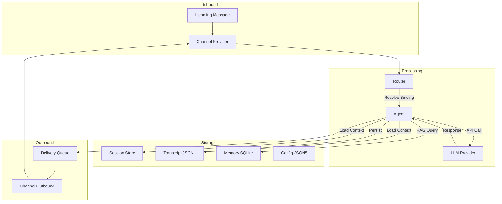
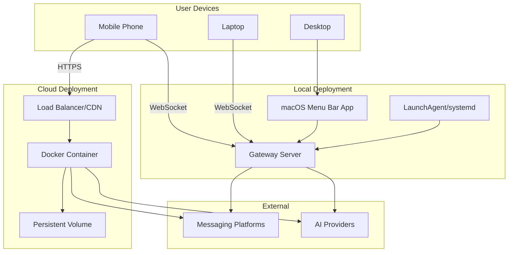

# OpenClaw Software Architecture Document (SAD)

> **Document Version:** 1.0  
> **Generated:** 01/03/2026  
> **Repository Version:** 2026.2.27  
> **Repository:** https://github.com/openclaw/openclaw

---

## Table of Contents

1. [Repository Overview](#1-repository-overview)
2. [System Context](#2-system-context)
3. [High-Level Architecture](#3-high-level-architecture)
4. [Data Architecture](#4-data-architecture)
5. [Feature Outline](#5-feature-outline)
6. [Deployment & Runtime](#6-deployment--runtime)
7. [Non-Functional & Quality Considerations](#7-non-functional--quality-considerations)
8. [Critical Analysis](#8-critical-analysis)
9. [Appendices](#appendices)

---

## 1. Repository Overview

### 1.1 Project Summary

**OpenClaw** is a multi-channel AI gateway that serves as a personal AI assistant platform. It provides a unified interface connecting AI models (Claude, OpenAI, Gemini, etc.) with various messaging platforms (WhatsApp, Telegram, Discord, Slack, Signal, iMessage, etc.).

| Attribute | Value |
|-----------|-------|
| **Repository** | https://github.com/openclaw/openclaw |
| **Version** | 2026.2.27 |
| **Licence** | MIT |
| **Package Manager** | pnpm 10.23.0 |
| **Runtime** | Node.js 22+ (Bun supported for dev) |

### 1.2 Languages, Frameworks, and Libraries

#### Core Stack (TypeScript/Node.js)

| Category | Technology |
|----------|------------|
| **Language** | TypeScript (ESM, strict mode) |
| **Runtime** | Node.js 22+, Bun (dev) |
| **Build** | tsdown (bundler) |
| **Testing** | Vitest (70% coverage threshold) |
| **Linting** | Oxlint, Oxfmt |
| **CLI Framework** | Commander |
| **Web Framework** | Express 5 |
| **WebSocket** | ws |

#### Key Dependencies

| Purpose | Library |
|---------|---------|
| **AI/LLM** | @mariozechner/pi-* (Pi agent framework) |
| **Telegram** | grammy, @grammyjs/runner |
| **Discord** | @buape/carbon, @discordjs/voice |
| **Slack** | @slack/bolt, @slack/web-api |
| **WhatsApp** | @whiskeysockets/baileys |
| **Signal** | signal-cli (external) |
| **Browser Automation** | playwright-core |
| **Database** | SQLite (node:sqlite), sqlite-vec |
| **Media Processing** | sharp, pdfjs-dist |
| **TTS** | node-edge-tts |
| **Schema Validation** | @sinclair/typebox, zod, ajv |

#### Native Apps

| Platform | Language/Framework |
|----------|-------------------|
| **macOS** | Swift 6.2, SwiftUI, Sparkle |
| **iOS** | Swift 6.0, SwiftUI, XcodeGen |
| **Android** | Kotlin, Jetpack Compose |
| **watchOS** | Swift, WatchKit |

#### Web UI

| Technology | Purpose |
|------------|---------|
| **Lit** | Web components |
| **Vite** | Build tool |

### 1.3 Directory Structure

```
openclaw/
├── apps/                    # Native mobile/desktop applications
│   ├── android/            # Android app (Kotlin/Jetpack Compose)
│   ├── ios/                # iOS app (Swift/SwiftUI)
│   ├── macos/              # macOS menu bar app (Swift)
│   └── shared/             # Shared Swift code (OpenClawKit)
├── assets/                 # Static assets (icons, images)
├── changelog/              # Changelog fragments
├── docs/                   # Documentation (Mintlify-hosted)
├── extensions/             # Channel plugins (32 extensions)
├── git-hooks/              # Git hooks
├── packages/               # Workspace packages
├── patches/                # pnpm patches for dependencies
├── scripts/                # Build, test, and utility scripts
├── skills/                 # AI agent skills (52+ skills)
├── src/                    # Core TypeScript source code
├── Swabble/                # Swift package (shared UI components)
├── test/                   # Test fixtures and helpers
├── ui/                     # Web control panel UI (Lit/Vite)
└── vendor/                 # Vendored dependencies (a2ui)
```

### 1.4 Source Code Structure (`src/`)

The `src/` directory contains ~70 subdirectories organised by domain:

#### Core Modules

| Directory | Purpose |
|-----------|---------|
| `cli/` | CLI command implementations (~146 files) |
| `commands/` | Command handlers (~261 files) |
| `gateway/` | Gateway server implementation (~199 files) |
| `agents/` | AI agent runtime, tools, auth profiles (~456 files) |
| `config/` | Configuration management (~181 files) |
| `infra/` | Infrastructure utilities (~275 files) |

#### Channel Integrations

| Directory | Channel |
|-----------|---------|
| `telegram/` | Telegram bot |
| `discord/` | Discord bot |
| `slack/` | Slack app |
| `signal/` | Signal messenger |
| `imessage/` | iMessage (macOS) |
| `web/` | WhatsApp Web |
| `line/` | LINE messenger |

#### Supporting Modules

| Directory | Purpose |
|-----------|---------|
| `browser/` | Browser automation |
| `memory/` | Memory/RAG system |
| `media/` | Media processing pipeline |
| `hooks/` | Lifecycle hooks |
| `plugins/` | Plugin system |
| `routing/` | Message routing |
| `security/` | Security utilities |
| `tui/` | Terminal UI |

### 1.5 Build, Test, and Deployment Scripts

| Command | Purpose |
|---------|---------|
| `pnpm install` | Install dependencies |
| `pnpm build` | Build TypeScript (tsdown) |
| `pnpm ui:build` | Build web UI (Vite) |
| `pnpm check` | Lint + format + typecheck |
| `pnpm test` | Run tests (Vitest) |
| `pnpm test:coverage` | Run tests with coverage |
| `pnpm test:e2e` | End-to-end tests |
| `pnpm test:live` | Live integration tests |
| `pnpm mac:package` | Package macOS app |
| `pnpm ios:build` | Build iOS app |
| `pnpm android:run` | Build and run Android app |

### 1.6 Entry Points

#### CLI Entry

```
openclaw.mjs → dist/entry.js → src/entry.ts → src/cli/run-main.ts → src/cli/program.ts
```

The CLI is built with Commander and supports commands like:
- `openclaw gateway` - Run the gateway server
- `openclaw agent` - Run AI agent
- `openclaw config` - Configuration management
- `openclaw channels` - Channel management
- `openclaw doctor` - Diagnostics

#### Library Entry

```
dist/index.js → src/index.ts
```

Exports core functionality for programmatic use.

#### Plugin SDK

```
dist/plugin-sdk/index.js → src/plugin-sdk/index.ts
```

Public API for building extensions.

---

## 2. System Context

### 2.1 External Systems and Users

The OpenClaw system interacts with:

1. **Users** - End users communicating via messaging platforms
2. **Messaging Platforms** - WhatsApp, Telegram, Discord, Slack, Signal, iMessage, etc.
3. **AI Model Providers** - Anthropic, OpenAI, Google, OpenRouter, etc.
4. **Native Apps** - macOS, iOS, Android companion applications
5. **External Services** - Apple Push Notifications, Tailscale, TTS providers

### 2.2 System Context Diagram



---

## 3. High-Level Architecture

### 3.1 Major Modules and Components

| Module | Location | Responsibility |
|--------|----------|----------------|
| **Gateway** | `src/gateway/` | WebSocket control plane, session management, routing |
| **Agent** | `src/agents/` | AI agent runtime, tools, auth profiles |
| **CLI** | `src/cli/`, `src/commands/` | Command-line interface |
| **Channels** | `src/channels/`, `src/telegram/`, etc. | Messaging platform integrations |
| **Plugins** | `src/plugins/` | Plugin system and registry |
| **Config** | `src/config/` | Configuration management |
| **Routing** | `src/routing/` | Message routing and bindings |
| **Memory** | `src/memory/` | RAG/memory system with vector search |
| **Media** | `src/media/` | Media processing pipeline |
| **Hooks** | `src/hooks/` | Lifecycle hooks system |
| **Browser** | `src/browser/` | Browser automation |
| **Infra** | `src/infra/` | Infrastructure utilities |

### 3.2 Component/Module Diagram



### 3.3 Extension Architecture

Extensions are workspace packages that register with the plugin system:



### 3.4 Key Architectural Patterns

| Pattern | Implementation |
|---------|----------------|
| **Lazy Loading** | Commands and channel implementations loaded on-demand |
| **Plugin Architecture** | Everything extensible through unified plugin API |
| **Dependency Injection** | Context objects passed through call chain |
| **Adapter Pattern** | Channels implement standardised adapter interfaces |
| **Registry Pattern** | Central registries for plugins, channels, providers |
| **WebSocket RPC** | Gateway uses WebSocket for real-time client communication |
| **Hook System** | Lifecycle hooks for extensibility at key points |
| **Binding-based Routing** | Flexible message routing through configurable bindings |
| **Write-ahead Queue** | Outbound delivery uses queue for crash recovery |

---

## 4. Data Architecture

### 4.1 Datastores

| Store | Technology | Location | Purpose |
|-------|------------|----------|---------|
| **Config** | JSON5 | `~/.openclaw/openclaw.json` | Application configuration |
| **Sessions** | JSON | `~/.openclaw/sessions.json` | Session metadata |
| **Transcripts** | JSONL | `~/.openclaw/agents/<id>/sessions/*.jsonl` | Conversation history |
| **Memory/RAG** | SQLite + sqlite-vec | `~/.openclaw/memory/` | Vector embeddings, FTS |
| **Credentials** | JSON | `~/.openclaw/credentials/` | OAuth tokens, API keys |
| **Push Registrations** | JSON | `~/.openclaw/push/` | APNS device registrations |

### 4.2 Data Flow Diagram



### 4.3 API Contracts and Formats

#### Gateway WebSocket Protocol

The Gateway uses a JSON-RPC-like protocol over WebSocket:

```typescript
// Request Frame
interface RequestFrame {
  id: string;
  method: string;
  params: Record<string, unknown>;
}

// Response Frame
interface ResponseFrame {
  id: string;
  result?: unknown;
  error?: { code: number; message: string };
}
```

#### Plugin SDK Interface

```typescript
interface OpenClawPluginApi {
  id: string;
  name: string;
  registerTool: (tool, opts?) => void;
  registerHook: (events, handler, opts?) => void;
  registerChannel: (registration) => void;
  registerGatewayMethod: (method, handler) => void;
  registerProvider: (provider) => void;
  registerCommand: (command) => void;
}
```

#### Channel Plugin Interface

```typescript
interface ChannelPlugin {
  id: ChannelId;
  meta: ChannelMeta;
  capabilities: ChannelCapabilities;
  config: ChannelConfigAdapter;
  setup?: ChannelSetupAdapter;
  pairing?: ChannelPairingAdapter;
  security?: ChannelSecurityAdapter;
  groups?: ChannelGroupAdapter;
  outbound?: ChannelOutboundAdapter;
  status?: ChannelStatusAdapter;
  gateway?: ChannelGatewayAdapter;
  streaming?: ChannelStreamingAdapter;
  messaging?: ChannelMessagingAdapter;
}
```

---

## 5. Feature Outline

| Feature Name | Description | Module(s) | Dependencies | Inputs/Outputs |
|--------------|-------------|-----------|--------------|----------------|
| **Multi-Channel Messaging** | Send/receive messages across 12+ platforms | `src/channels/`, `extensions/*` | grammy, baileys, @slack/bolt, @buape/carbon | Messages in/out |
| **AI Agent Runtime** | Pi-based agent with tool calling | `src/agents/` | @mariozechner/pi-* | User prompts → AI responses |
| **Gateway Control Plane** | WebSocket server for all clients | `src/gateway/` | ws, express | WS connections, HTTP routes |
| **Session Management** | Conversation state and history | `src/config/sessions/` | - | Session CRUD |
| **Memory/RAG** | Vector search and context retrieval | `src/memory/` | sqlite-vec | Documents → embeddings → search |
| **Browser Automation** | Playwright-based web control | `src/browser/` | playwright-core | URLs → screenshots, actions |
| **Voice Wake** | Always-on speech recognition | `apps/macos/`, `apps/ios/` | Native speech APIs | Audio → text commands |
| **Talk Mode** | Voice conversation interface | `apps/*` | TTS providers | Text ↔ speech |
| **Live Canvas** | Agent-driven visual workspace | `src/canvas-host/` | A2UI | Agent commands → UI updates |
| **Cron Jobs** | Scheduled task execution | `src/gateway/cron/` | croner | Schedules → agent invocations |
| **Webhooks** | HTTP trigger endpoints | `src/gateway/webhooks/` | express | HTTP requests → agent actions |
| **Skills System** | Bundled/managed/workspace skills | `skills/` | - | Skill definitions → agent capabilities |
| **Plugin System** | Extensible architecture | `src/plugins/` | jiti | Plugin packages → registered features |
| **Media Pipeline** | Image/audio/video processing | `src/media/` | sharp, pdfjs-dist | Media files → processed content |
| **Auth Profiles** | Multi-provider API key rotation | `src/agents/auth-profiles.ts` | - | Credentials → failover chain |
| **Device Pairing** | Secure device registration | `src/pairing/` | - | Challenge/response → allowlist |
| **Control UI** | Web-based management interface | `ui/` | Lit, Vite | Browser → gateway control |
| **WebChat** | Browser-based chat interface | `ui/` | Lit | Browser → agent conversation |
| **macOS App** | Menu bar companion | `apps/macos/` | Swift, Sparkle | Native UI → gateway |
| **iOS App** | Mobile companion | `apps/ios/` | Swift, SwiftUI | Native UI → gateway |
| **Android App** | Mobile companion | `apps/android/` | Kotlin, Compose | Native UI → gateway |

---

## 6. Deployment & Runtime

### 6.1 Deployment Topology

OpenClaw supports multiple deployment models:

| Model | Description | Use Case |
|-------|-------------|----------|
| **Local** | Gateway on user's machine | Personal use, development |
| **VPS/Cloud** | Docker container on remote server | Always-on, multi-device access |
| **Fly.io** | Managed container deployment | Easy cloud deployment |
| **Hybrid** | Local gateway + remote nodes | Mobile access to local gateway |

### 6.2 Deployment Diagram



### 6.3 Environment Requirements

| Requirement | Specification |
|-------------|---------------|
| **Node.js** | ≥22.12.0 |
| **Memory** | 2GB recommended (512MB minimum) |
| **Storage** | ~500MB for installation + data |
| **Network** | Outbound HTTPS to AI providers and messaging platforms |
| **Ports** | 18789 (Gateway WS), 18790 (HTTP) |

### 6.4 Docker Configuration

```dockerfile
FROM node:22-bookworm
WORKDIR /app
COPY . .
RUN npm install -g openclaw@latest
USER node
CMD ["openclaw", "gateway", "--bind", "0.0.0.0", "--port", "18789"]
```

### 6.5 Native App Platforms

| Platform | Minimum OS | Build System |
|----------|------------|--------------|
| **macOS** | macOS 15 (Sequoia) | Swift Package Manager |
| **iOS** | iOS 18.0 | XcodeGen + Xcode |
| **Android** | SDK 31 (Android 12) | Gradle (Kotlin DSL) |
| **watchOS** | watchOS 11.0 | Xcode |

### 6.6 Scaling Considerations

| Aspect | Consideration |
|--------|---------------|
| **Horizontal Scaling** | Not supported (single gateway owns sessions) |
| **Vertical Scaling** | Increase memory/CPU for more concurrent sessions |
| **Multi-User** | Separate gateway instances per user |
| **Session Limits** | Bounded by WhatsApp/Telegram rate limits |

### 6.7 CI/CD (GitHub Actions)

| Workflow | Purpose |
|----------|---------|
| `ci.yml` | Main CI: lint, test, build for Node/Bun, Windows, macOS, Android |
| `docker-release.yml` | Multi-arch Docker builds (amd64 + arm64) to GHCR |
| `install-smoke.yml` | Installer smoke tests |
| `labeler.yml` | PR auto-labelling |
| `stale.yml` | Stale issue management |

---

## 7. Non-Functional & Quality Considerations

### 7.1 Performance

| Aspect | Implementation |
|--------|----------------|
| **Lazy Loading** | Commands and channels loaded on-demand |
| **Connection Pooling** | WebSocket connections reused |
| **Caching** | Config cached with TTL, embedding cache in SQLite |
| **Streaming** | LLM responses streamed to reduce latency |
| **Debouncing** | Message delivery debounced per channel |

### 7.2 Scalability

| Aspect | Approach |
|--------|----------|
| **Single-User Design** | Optimised for personal use, not multi-tenant |
| **Memory Efficiency** | Lazy loading, streaming, bounded caches |
| **Session Management** | Automatic pruning of old sessions |
| **Queue System** | Write-ahead queue for crash recovery |

### 7.3 Maintainability

| Aspect | Implementation |
|--------|----------------|
| **Modular Architecture** | Plugin system for extensibility |
| **Type Safety** | Strict TypeScript, Zod/Typebox schemas |
| **Testing** | 70% coverage threshold, multiple test tiers |
| **Documentation** | Mintlify-hosted docs, inline JSDoc |
| **Code Quality** | Oxlint/Oxfmt, pre-commit hooks |

### 7.4 Reliability

| Aspect | Implementation |
|--------|----------------|
| **Error Recovery** | Write-ahead queue, automatic reconnection |
| **Health Checks** | `openclaw doctor` diagnostics |
| **Logging** | tslog with structured output |
| **Graceful Shutdown** | Signal handlers, cleanup on exit |

### 7.5 Security

| Aspect | Implementation |
|--------|----------------|
| **Authentication** | Token/password auth for gateway access |
| **DM Policy** | Pairing-based allowlists by default |
| **Credential Storage** | Separate credentials directory |
| **Input Validation** | Zod/Typebox schema validation |
| **Sandbox** | Docker sandbox for code execution |
| **Rate Limiting** | Failed auth attempt limiting |

### 7.6 Error Handling & Logging

| Component | Approach |
|-----------|----------|
| **Gateway** | Structured JSON logs via tslog |
| **Agent** | Tool call errors captured in transcript |
| **Channels** | Per-channel error handling with retry |
| **CLI** | User-friendly error messages with suggestions |

### 7.7 Monitoring

| Aspect | Implementation |
|--------|----------------|
| **Health Endpoint** | Gateway health check API |
| **Status Command** | `openclaw channels status --probe` |
| **Diagnostics** | OpenTelemetry extension available |
| **Audit Logs** | Config changes logged to `config-audit.jsonl` |

---

## 8. Critical Analysis

### 8.1 Strengths

| Strength | Description |
|----------|-------------|
| **Extensibility** | Plugin architecture allows adding channels/tools without core changes |
| **Multi-Platform** | Native apps for macOS, iOS, Android with shared protocol |
| **Type Safety** | Strict TypeScript with comprehensive schema validation |
| **Local-First** | User owns their data, no cloud dependency required |
| **Unified Interface** | Single gateway handles all messaging platforms |
| **Developer Experience** | Comprehensive CLI, hot-reload in dev, good documentation |
| **Testing** | Multiple test tiers (unit, e2e, live, Docker) with coverage thresholds |

### 8.2 Weaknesses

| Weakness | Description | Impact |
|----------|-------------|--------|
| **Single-User Design** | Not designed for multi-tenant deployment | Limits enterprise use |
| **Session Ownership** | One gateway owns all sessions (no horizontal scaling) | Availability risk |
| **Complexity** | Large codebase (~70 src subdirectories) | Onboarding curve |
| **Native Dependencies** | Some features require native binaries (signal-cli, Playwright) | Installation complexity |
| **WhatsApp Dependency** | Baileys library is unofficial, may break | Channel reliability |

### 8.3 Potential Bottlenecks

| Bottleneck | Location | Mitigation |
|------------|----------|------------|
| **LLM API Latency** | Agent → Provider | Streaming, auth profile rotation |
| **Memory Usage** | Large transcripts | Session pruning, compaction |
| **SQLite Contention** | Memory/RAG queries | Connection pooling, WAL mode |
| **Message Queue** | High-volume channels | Debouncing, rate limiting |

### 8.4 Security Considerations

| Risk | Current Mitigation | Recommendation |
|------|-------------------|----------------|
| **DM Injection** | Pairing-based allowlists | Document threat model |
| **Credential Storage** | File-based, user-readable | Consider OS keychain integration |
| **Plugin Trust** | No sandboxing for plugins | Add plugin permission system |
| **WebSocket Auth** | Token/password only | Add mTLS option |

### 8.5 Recommendations for Improvement

1. **Plugin Sandboxing** - Add permission system for plugins to limit access to sensitive APIs

2. **Credential Security** - Integrate with OS keychain (macOS Keychain, Windows Credential Manager) for credential storage

3. **Observability** - Expand OpenTelemetry integration for production monitoring

4. **Session Replication** - Consider optional session replication for high-availability deployments

5. **API Documentation** - Generate OpenAPI spec from Gateway methods for client development

6. **Performance Profiling** - Add built-in profiling tools for diagnosing performance issues

7. **Migration Tooling** - Improve `openclaw doctor` with automated migration scripts

8. **Plugin Marketplace** - Create discovery mechanism for community plugins

---

## Appendices

### Appendix A: Extension List

| Extension | Type | Description |
|-----------|------|-------------|
| `telegram` | Channel | Telegram bot integration |
| `discord` | Channel | Discord bot integration |
| `slack` | Channel | Slack app integration |
| `whatsapp` | Channel | WhatsApp Web integration |
| `signal` | Channel | Signal messenger integration |
| `imessage` | Channel | iMessage integration |
| `matrix` | Channel | Matrix protocol integration |
| `msteams` | Channel | Microsoft Teams integration |
| `googlechat` | Channel | Google Chat integration |
| `line` | Channel | LINE messenger integration |
| `feishu` | Channel | Feishu/Lark integration |
| `mattermost` | Channel | Mattermost integration |
| `twitch` | Channel | Twitch chat integration |
| `irc` | Channel | IRC protocol integration |
| `nostr` | Channel | Nostr protocol integration |
| `zalo` | Channel | Zalo messenger integration |
| `zalouser` | Channel | Zalo personal integration |
| `bluebubbles` | Channel | BlueBubbles (iMessage) integration |
| `nextcloud-talk` | Channel | Nextcloud Talk integration |
| `synology-chat` | Channel | Synology Chat integration |
| `tlon` | Channel | Tlon integration |
| `voice-call` | Channel | Voice calling integration |
| `memory-core` | Utility | Memory system core |
| `memory-lancedb` | Utility | LanceDB vector store |
| `diagnostics-otel` | Utility | OpenTelemetry diagnostics |
| `copilot-proxy` | Utility | GitHub Copilot proxy |
| `llm-task` | Utility | LLM task runner |
| `lobster` | Utility | CLI theming |
| `acpx` | Utility | Agent Client Protocol |
| `open-prose` | Utility | Prose editing |
| `google-gemini-cli-auth` | Auth | Gemini CLI authentication |
| `minimax-portal-auth` | Auth | Minimax portal authentication |

### Appendix B: Lifecycle Hooks

| Hook | Trigger Point |
|------|---------------|
| `before_model_resolve` | Before selecting AI model |
| `before_prompt_build` | Before constructing prompt |
| `before_agent_start` | Before agent begins processing |
| `llm_input` | Before LLM API call |
| `llm_output` | After LLM response |
| `agent_end` | After agent completes |
| `before_compaction` | Before session compaction |
| `after_compaction` | After session compaction |
| `message_received` | When message arrives |
| `message_sending` | Before message sent |
| `message_sent` | After message delivered |
| `before_tool_call` | Before tool execution |
| `after_tool_call` | After tool execution |
| `session_start` | When session begins |
| `session_end` | When session ends |
| `gateway_start` | When gateway starts |
| `gateway_stop` | When gateway stops |

### Appendix C: Configuration Schema (Key Sections)

```typescript
interface OpenClawConfig {
  meta?: { version?: string };
  env?: Record<string, string>;
  agents?: {
    default?: AgentConfig;
    [agentId: string]: AgentConfig;
  };
  channels?: {
    telegram?: TelegramConfig;
    discord?: DiscordConfig;
    slack?: SlackConfig;
    whatsapp?: WhatsAppConfig;
    signal?: SignalConfig;
    imessage?: iMessageConfig;
    // ... other channels
  };
  gateway?: {
    bind?: 'loopback' | 'tailscale' | 'all';
    port?: number;
    auth?: GatewayAuthConfig;
    tls?: TLSConfig;
  };
  models?: ModelProviderConfig[];
  tools?: ToolConfig;
  memory?: MemoryConfig;
  hooks?: HookConfig[];
  approvals?: ApprovalConfig;
}
```

### Appendix D: Routing Binding Match Tiers

Message routing resolves through these tiers (priority order):

1. `binding.peer` - Direct peer match
2. `binding.peer.parent` - Thread parent inheritance
3. `binding.guild+roles` - Discord guild with role matching
4. `binding.guild` - Discord guild match
5. `binding.team` - Slack team match
6. `binding.account` - Account-specific binding
7. `binding.channel` - Channel-wide binding
8. `default` - Fallback to default agent

---

*Document generated: 01/03/2026*  
*Repository version: 2026.2.27*  
*Source: https://github.com/openclaw/openclaw*
