# Remy — Software Architecture Document (SAD)

**Version:** 1.0  
**Date:** 01/03/2026  
**Status:** Internal Engineering Document  

---

## Table of Contents

1. [Repository Overview](#1-repository-overview)
2. [System Context](#2-system-context)
3. [High-Level Architecture](#3-high-level-architecture)
4. [Data Architecture](#4-data-architecture)
5. [Feature Outline](#5-feature-outline)
6. [Deployment & Runtime](#6-deployment--runtime)
7. [Non-Functional & Quality Considerations](#7-non-functional--quality-considerations)
8. [Critical Analysis](#8-critical-analysis)

---

## 1. Repository Overview

### 1.1 Languages, Frameworks & Libraries

| Category | Technology | Version |
|----------|------------|---------|
| **Language** | Python | 3.12 |
| **Bot Framework** | python-telegram-bot | ≥22.0 |
| **AI Client** | anthropic | ≥0.40 |
| **Configuration** | pydantic / pydantic-settings | ≥2.0 |
| **Database** | aiosqlite | ≥0.19 |
| **Vector Search** | sqlite-vec | ≥0.1 |
| **Embeddings** | sentence-transformers | ≥3.0 |
| **Voice** | faster-whisper | ≥1.0 |
| **Web Search** | ddgs | ≥9.0 |
| **Google APIs** | google-api-python-client | ≥2.100 |
| **HTTP** | httpx / aiohttp | ≥0.27 / ≥3.9 |
| **Scheduling** | apscheduler | ≥3.10 |
| **Metrics** | prometheus-client | ≥0.20.0 |

### 1.2 Directory Structure

```
remy/
├── remy/                    # Main Python package
│   ├── ai/                  # AI clients, router, classifier, tools
│   ├── agents/              # Board of Directors sub-agents
│   ├── analytics/           # Metrics, call logging, cost tracking
│   ├── bot/                 # Telegram bot handlers, streaming
│   ├── diagnostics/         # Health checks, error logging
│   ├── google/              # Google Workspace integrations
│   ├── memory/              # Database, embeddings, knowledge store
│   ├── scheduler/           # Proactive messaging (APScheduler)
│   ├── utils/               # Formatting, circuit breakers, concurrency
│   ├── voice/               # Whisper transcription
│   ├── web/                 # DuckDuckGo search
│   ├── config.py            # Pydantic settings
│   ├── health.py            # HTTP health server
│   ├── main.py              # Entry point
│   └── models.py            # Shared Pydantic models
├── config/                  # Configuration files
│   ├── SOUL.md              # Agent personality (gitignored)
│   ├── SOUL.example.md      # Template for SOUL.md
│   └── datasette.yml        # Datasette config for DB browsing
├── data/                    # Runtime data (SQLite DBs, logs, sessions)
├── docs/                    # Documentation
│   ├── architecture/        # Architecture documents
│   └── backlog/             # User stories and PBIs
├── relay_mcp/               # Inter-agent MCP server
├── scripts/                 # Utility scripts
├── tests/                   # Pytest test suite (42 test files)
├── .claude/                 # Claude-specific rules and skills
├── Dockerfile               # Multi-stage Docker build
├── docker-compose.yml       # Local dev stack
├── Makefile                 # Build/deploy commands
├── requirements.txt         # Production dependencies
└── requirements-dev.txt     # Development dependencies
```

### 1.3 Build, Test & Deployment

| Command | Description |
|---------|-------------|
| `make setup` | Create venv and install dev dependencies |
| `make run` | Run locally via `python3 -m remy.main` |
| `make test` | Run pytest suite |
| `make test-cov` | Run tests with coverage report |
| `make lint` | Run ruff + mypy |
| `make docker-run` | Build and run via docker-compose |
| `make deploy` | Build, push to ACR, create Azure Container Instance |
| `make deploy-update` | Push updated image and restart container |

---

## 2. System Context

Remy is a personal AI assistant that operates as a Telegram bot, integrating with multiple AI providers and Google Workspace services.

### 2.1 System Context Diagram

```mermaid
graph TB
    subgraph External Users
        User[👤 User via Telegram]
    end

    subgraph External Systems
        TG[Telegram API]
        Claude[Anthropic Claude API]
        Mistral[Mistral AI API]
        Moonshot[Moonshot AI API]
        Ollama[Ollama Local LLM]
        GCal[Google Calendar API]
        Gmail[Gmail API]
        GDocs[Google Docs API]
        GContacts[Google People API]
        DDG[DuckDuckGo Search]
    end

    subgraph Remy System
        Bot[Telegram Bot]
        Router[Model Router]
        Memory[Memory System]
        Scheduler[Proactive Scheduler]
        Health[Health Server]
    end

    subgraph Data Stores
        SQLite[(SQLite + sqlite-vec)]
        Files[JSONL Session Files]
    end

    User -->|Messages| TG
    TG -->|Webhook/Polling| Bot
    Bot -->|Responses| TG
    TG -->|Delivers| User

    Bot --> Router
    Router --> Claude
    Router --> Mistral
    Router --> Moonshot
    Router --> Ollama

    Bot --> Memory
    Memory --> SQLite
    Memory --> Files

    Bot --> GCal
    Bot --> Gmail
    Bot --> GDocs
    Bot --> GContacts
    Bot --> DDG

    Scheduler --> Bot
    Health -->|/health, /metrics| External[Prometheus/Probes]
```



### 2.2 External System Interactions

| System | Protocol | Purpose |
|--------|----------|---------|
| **Telegram** | HTTPS (Bot API) | User interface — messages, commands, voice, photos |
| **Anthropic Claude** | HTTPS (REST) | Primary AI — streaming, tool use, prompt caching |
| **Mistral AI** | HTTPS (REST) | Routine tasks, long-context summarisation |
| **Moonshot AI** | HTTPS (REST) | Extended context (128k+), reasoning tasks |
| **Ollama** | HTTP (localhost) | Local fallback when cloud APIs unavailable |
| **Google Calendar** | HTTPS (REST) | Read/create calendar events |
| **Gmail** | HTTPS (REST) | Read/search/label/archive emails, create drafts |
| **Google Docs** | HTTPS (REST) | Read/append to documents |
| **Google People** | HTTPS (REST) | Contact search, birthdays, notes |
| **DuckDuckGo** | HTTPS | Web search (no API key required) |

---

## 3. High-Level Architecture

### 3.1 Component/Module Diagram


### 3.2 Module Responsibilities

| Module | Responsibility |
|--------|----------------|
| **main.py** | Application entry point; initialises all components, starts bot and health server |
| **telegram_bot.py** | PTB Application builder; registers handlers; manages polling/webhook mode |
| **handlers.py** | ~3300 lines of command and message handlers; core business logic |
| **router.py** | Category-based model selection; fallback chain with circuit breakers |
| **classifier.py** | Heuristic message classification (routine/reasoning/coding/safety/persona) |
| **claude_client.py** | Anthropic API client; streaming, tool use loop, prompt caching |
| **tool_registry.py** | 60+ tool schemas and executors for native function calling |
| **database.py** | SQLite manager; WAL mode; sqlite-vec extension; schema migrations |
| **embeddings.py** | Vector embeddings via sentence-transformers; ANN search |
| **injector.py** | Memory context builder; injects facts, goals, emotions into system prompt |
| **conversations.py** | JSONL session persistence; reverse file reading for O(limit) performance |
| **orchestrator.py** | Board of Directors pattern; runs sub-agents sequentially |
| **proactive.py** | APScheduler-based morning briefings, check-ins, reminders |
| **health.py** | HTTP server for `/health`, `/ready`, `/metrics` endpoints |

### 3.3 Third-Party Integrations


---

## 4. Data Architecture

### 4.1 Data Stores

| Store | Technology | Purpose |
|-------|------------|---------|
| **remy.db** | SQLite + WAL | Primary data store (users, facts, goals, embeddings, etc.) |
| **sqlite-vec** | SQLite extension | Approximate nearest neighbour (ANN) vector search |
| **FTS5** | SQLite extension | Full-text search fallback |
| **JSONL files** | File system | Per-session conversation history |
| **relay.db** | SQLite | Inter-agent communication (relay_mcp) |

### 4.2 Database Schema


### 4.3 Data Flow Diagram


### 4.4 API Contracts

#### Claude API (Tool Use)

```json
{
  "model": "claude-sonnet-4-6",
  "max_tokens": 4096,
  "system": [
    {"type": "text", "text": "<SOUL content>", "cache_control": {"type": "ephemeral"}},
    {"type": "text", "text": "<memory>...</memory>"}
  ],
  "messages": [
    {"role": "user", "content": "What's on my calendar today?"},
    {"role": "assistant", "content": "...", "tool_use": {...}},
    {"role": "user", "content": [{"type": "tool_result", ...}]}
  ],
  "tools": [
    {"name": "calendar_events", "description": "...", "input_schema": {...}}
  ]
}
```

#### Embedding Model

- **Model:** `all-MiniLM-L6-v2`
- **Dimensions:** 384 (float32)
- **Storage:** sqlite-vec virtual table

---

## 5. Feature Outline

### 5.1 User-Facing Features

| Feature | Description | Module(s) | Dependencies | Inputs/Outputs |
|---------|-------------|-----------|--------------|----------------|
| **Natural Language Chat** | Conversational AI with memory | handlers.py, router.py, claude_client.py | Anthropic API | Text → Text |
| **Voice Messages** | Transcribe and respond to voice | handlers.py, transcriber.py | faster-whisper | Audio → Text |
| **Calendar Management** | View/create calendar events | handlers.py, calendar.py | Google Calendar API | Commands → Events |
| **Email Triage** | Read, search, label, archive emails | handlers.py, gmail.py | Gmail API | Commands → Email actions |
| **Contact Lookup** | Search contacts, birthdays, notes | handlers.py, contacts.py | Google People API | Name → Contact info |
| **Web Search** | DuckDuckGo search with synthesis | handlers.py, search.py, tool_registry.py | ddgs | Query → Results |
| **File Operations** | Read/write/search files | handlers.py, tool_registry.py | Filesystem | Path → Content |
| **Goal Tracking** | Set, track, complete goals | handlers.py, goals.py, knowledge.py | SQLite | Goal → Status |
| **Grocery List** | Maintain shopping list | handlers.py, knowledge.py | SQLite | Items → List |
| **Reminders** | Schedule daily/weekly/one-time | handlers.py, automations.py, proactive.py | APScheduler | Schedule → Notification |
| **Board of Directors** | Multi-perspective analysis | handlers.py, orchestrator.py, agents/* | Claude API | Topic → Report |
| **Morning Briefing** | Proactive daily summary | proactive.py, injector.py | APScheduler, Google APIs | Cron → Message |
| **Document Handling** | Read/append Google Docs | handlers.py, docs.py | Google Docs API | URL → Content |
| **Photo Analysis** | Describe uploaded photos | handlers.py, claude_client.py | Anthropic API | Image → Description |

### 5.2 System-Facing Features

| Feature | Description | Module(s) | Dependencies |
|---------|-------------|-----------|--------------|
| **Model Routing** | Category-based model selection | router.py, classifier.py | Multiple AI APIs |
| **Circuit Breakers** | Automatic fallback on failures | circuit_breaker.py, router.py | — |
| **Prompt Caching** | 90% cost reduction on static content | claude_client.py | Anthropic API |
| **Memory Injection** | Context-aware responses | injector.py, embeddings.py | sqlite-vec |
| **Session Management** | Per-user locks, state isolation | session.py | asyncio |
| **Rate Limiting** | Token/cost budgets per user | input_validator.py, handlers.py | SQLite |
| **Health Monitoring** | Liveness/readiness probes | health.py | aiohttp |
| **Prometheus Metrics** | Telemetry and observability | metrics.py | prometheus-client |
| **Background Jobs** | Async task execution | background_jobs.py, background.py | asyncio |

### 5.3 Configuration Options

| Setting | Environment Variable | Default | Description |
|---------|---------------------|---------|-------------|
| Bot Token | `TELEGRAM_BOT_TOKEN` | — | Required. Telegram bot token |
| Anthropic Key | `ANTHROPIC_API_KEY` | — | Required. Claude API key |
| Simple Model | `MODEL_SIMPLE` | `claude-haiku-4-5-20251001` | Model for routine tasks |
| Complex Model | `MODEL_COMPLEX` | `claude-sonnet-4-6` | Model for complex tasks |
| Mistral Key | `MISTRAL_API_KEY` | — | Optional. Mistral API key |
| Moonshot Key | `MOONSHOT_API_KEY` | — | Optional. Moonshot API key |
| Ollama URL | `OLLAMA_BASE_URL` | `http://localhost:11434` | Local fallback endpoint |
| Briefing Cron | `BRIEFING_CRON` | `0 7 * * *` | Morning briefing schedule |
| Check-in Cron | `CHECKIN_CRON` | `0 19 * * *` | Evening check-in schedule |
| Timezone | `SCHEDULER_TIMEZONE` | `Australia/Sydney` | User timezone |
| Max Input Tokens | `MAX_INPUT_TOKENS_PER_REQUEST` | 50,000 | Token budget per request |
| Max Cost/Day | `MAX_COST_PER_USER_PER_DAY_USD` | 10.0 | Daily cost limit |
| Data Directory | `DATA_DIR` | `./data` | SQLite and session storage |

---

## 6. Deployment & Runtime

### 6.1 Deployment Topology


### 6.2 Local Development Stack


### 6.3 Container Specification

```dockerfile
# Multi-stage build
FROM python:3.12-slim AS builder
# Install dependencies, pre-download embedding model

FROM python:3.12-slim AS runtime
# Non-root user (remy:1001)
# ffmpeg for audio processing
# Health check on port 8080
# Volume mount at /data
```

**Resource Requirements:**
- CPU: 0.5 cores (Azure ACI)
- Memory: 1.5 GB
- Storage: Azure Files share for persistence

### 6.4 Health Endpoints

| Endpoint | Response | Purpose |
|----------|----------|---------|
| `GET /` | `{"service": "remy", "version": "1.0"}` | Service identification |
| `GET /health` | `{"status": "ok", "uptime_s": N}` | Liveness probe |
| `GET /ready` | `{"status": "ready"}` or 503 | Readiness probe |
| `GET /metrics` | Prometheus text format | Observability |

### 6.5 Scaling Considerations

- **Single Instance:** Current design assumes single-writer SQLite pattern
- **Horizontal Scaling:** Would require:
  - PostgreSQL or similar for shared state
  - Redis for session management
  - Message queue for background jobs
- **Vertical Scaling:** Memory primarily consumed by embedding model (~500MB)

---

## 7. Non-Functional & Quality Considerations

### 7.1 Performance

| Metric | Target | Implementation |
|--------|--------|----------------|
| **Time to First Token (TTFT)** | <2s | Prompt caching, lazy loading |
| **Memory Injection Latency** | <200ms | Parallel fetches, ANN search |
| **Conversation Load** | O(limit) | Reverse file reading |
| **Embedding Encode** | <100ms | Semaphore-limited concurrency |
| **Cold Start** | <30s | Pre-downloaded models in Docker |

### 7.2 Scalability

- **Token Budgets:** Per-request and per-user-per-hour limits
- **Cost Caps:** Daily USD limit per user
- **Circuit Breakers:** Automatic fallback prevents cascade failures
- **Background Jobs:** Async execution for long-running tasks

### 7.3 Maintainability

- **Type Hints:** Full typing with mypy validation
- **Linting:** ruff for style enforcement
- **Test Coverage:** 42 test files covering all major modules
- **Documentation:** Inline docstrings, architecture docs, backlog

### 7.4 Reliability

| Pattern | Implementation |
|---------|----------------|
| **Circuit Breakers** | 5 failures → 60s recovery timeout |
| **Retry with Backoff** | Exponential backoff on rate limits |
| **Graceful Degradation** | Ollama fallback when cloud APIs fail |
| **Health Monitoring** | 5-minute ping checks with user alerts |
| **WAL Mode** | Concurrent read safety for SQLite |

### 7.5 Security

| Area | Implementation |
|------|----------------|
| **Authentication** | Telegram user allowlist (`TELEGRAM_ALLOWED_USERS`) |
| **Path Sanitisation** | Restricted to `~/Projects`, `~/Documents`, `~/Downloads` |
| **Sensitive Files** | Blocked access to `.env`, `.ssh/`, `.aws/`, credentials |
| **Input Validation** | Rate limiting, injection protection |
| **Non-root Container** | User `remy:1001` in Docker |
| **Secrets Management** | Environment variables, Azure secure env vars |

### 7.6 Error Handling & Logging

```python
# Structured logging with levels
logger = logging.getLogger(__name__)
logger.info("Processing message", extra={"user_id": user_id})
logger.warning("Rate limit approaching", extra={"remaining": tokens})
logger.error("API call failed", exc_info=True)
```

- **Log Levels:** DEBUG, INFO, WARNING, ERROR
- **Log Destination:** stdout (Docker), file (local)
- **Error Recovery:** Graceful fallback, user notification
- **Prometheus Counters:** `remy_errors_total` by type

### 7.7 Monitoring

| Metric | Type | Labels |
|--------|------|--------|
| `remy_request_latency_seconds` | Histogram | phase |
| `remy_ttft_seconds` | Histogram | model |
| `remy_api_calls_total` | Counter | provider, model, call_site |
| `remy_context_tokens` | Histogram | — |
| `remy_output_tokens` | Histogram | — |
| `remy_tool_executions_total` | Counter | tool_name |
| `remy_cache_hit_rate` | Histogram | — |
| `remy_errors_total` | Counter | error_type |

---

## 8. Critical Analysis

### 8.1 Architecture Strengths

1. **Modular Design**
   - Clear separation of concerns (AI, Memory, Bot, Integrations)
   - Each module is independently testable
   - Easy to add new AI providers or integrations

2. **Intelligent Model Routing**
   - Cost optimisation through category-based routing
   - Automatic fallback chain prevents service disruption
   - Circuit breakers protect against cascade failures

3. **Memory System**
   - Semantic search via embeddings enables context-aware responses
   - Recency boost keeps recent information relevant
   - Parallel fetches minimise latency

4. **Prompt Caching**
   - 90% cost reduction on cache hits
   - Static SOUL content cached across requests
   - Significant cost savings at scale

5. **Tool-First Design**
   - Natural language invokes same functionality as slash commands
   - 60+ tools provide comprehensive capability
   - Agentic loop handles multi-step tasks

6. **Proactive Engagement**
   - Morning briefings and evening check-ins
   - Scheduled reminders and automations
   - Transforms passive assistant into active companion

7. **Comprehensive Testing**
   - 42 test files covering all major modules
   - Isolated test fixtures prevent side effects
   - Load testing with Locust

### 8.2 Architecture Weaknesses

1. **Single-Instance Limitation**
   - SQLite single-writer pattern prevents horizontal scaling
   - All state in one process limits availability
   - No built-in redundancy

2. **Handler Monolith**
   - `handlers.py` at 3300+ lines is difficult to navigate
   - Business logic mixed with Telegram-specific code
   - Would benefit from further decomposition

3. **Synchronous Embedding**
   - Embedding model blocks event loop during encode
   - Semaphore limits concurrency but doesn't eliminate blocking
   - Could benefit from dedicated worker process

4. **Memory Injection Complexity**
   - XML-based injection is fragile
   - No versioning of memory format
   - Difficult to debug context issues

5. **Limited Observability**
   - Prometheus metrics available but not dashboarded
   - No distributed tracing
   - Log aggregation not implemented

### 8.3 Potential Bottlenecks

| Bottleneck | Impact | Mitigation |
|------------|--------|------------|
| **SQLite Writes** | Single-writer limits throughput | WAL mode, async writes |
| **Embedding Encode** | CPU-bound, blocks event loop | Semaphore, executor |
| **Claude API Latency** | 1-3s TTFT affects UX | Streaming, prompt caching |
| **Memory Injection** | Adds 100-200ms per request | Parallel fetches, caching |
| **Large Conversations** | Context window limits | Compaction, summarisation |

### 8.4 Security Considerations

| Risk | Severity | Status |
|------|----------|--------|
| **Prompt Injection** | Medium | Mitigated via input validation |
| **Path Traversal** | High | Mitigated via allowlist |
| **Credential Exposure** | Critical | Mitigated via env vars, blocked paths |
| **Rate Limit Bypass** | Medium | Mitigated via per-user budgets |
| **Telegram Spoofing** | Low | Mitigated via user allowlist |

### 8.5 Recommendations

#### Short-Term Improvements

1. **Split handlers.py**
   - Extract command handlers into separate modules
   - Create service layer for business logic
   - Improve testability and maintainability

2. **Add Structured Logging**
   - Implement JSON logging format
   - Add correlation IDs for request tracing
   - Integrate with log aggregation service

3. **Improve Memory Debugging**
   - Add `/debug_memory` command
   - Log injected context for troubleshooting
   - Version memory format

#### Medium-Term Improvements

1. **Background Embedding Worker**
   - Move embedding to separate process
   - Use message queue for communication
   - Eliminate event loop blocking

2. **Observability Dashboard**
   - Deploy Grafana with Prometheus
   - Create dashboards for key metrics
   - Set up alerting rules

3. **Integration Tests**
   - Add end-to-end tests with mocked APIs
   - Test full message flow
   - Automate regression testing

#### Long-Term Improvements

1. **Horizontal Scaling**
   - Migrate to PostgreSQL with pgvector
   - Implement Redis for session state
   - Use message queue for background jobs

2. **Multi-Tenancy**
   - Support multiple users with isolated data
   - Implement proper authentication
   - Add usage quotas and billing

3. **Plugin Architecture**
   - Define plugin interface for integrations
   - Allow runtime plugin loading
   - Enable community contributions

---

## Appendix A: Tool Registry

The tool registry exposes 60+ tools for native Anthropic function calling:

| Category | Tools |
|----------|-------|
| **Time** | `get_current_time` |
| **Memory** | `get_logs`, `get_goals`, `get_facts`, `manage_memory`, `manage_goal`, `get_memory_summary` |
| **Analysis** | `run_board`, `check_status` |
| **Calendar** | `calendar_events`, `create_calendar_event` |
| **Gmail** | `read_emails`, `search_gmail`, `read_email`, `list_gmail_labels`, `label_emails`, `create_gmail_label`, `create_email_draft`, `classify_promotional_emails` |
| **Contacts** | `search_contacts`, `upcoming_birthdays`, `get_contact_details`, `update_contact_note`, `find_sparse_contacts` |
| **Web** | `web_search`, `price_check` |
| **Files** | `read_file`, `list_directory`, `write_file`, `append_file`, `find_files`, `scan_downloads`, `organize_directory`, `clean_directory`, `search_files`, `index_status` |
| **Documents** | `read_gdoc`, `append_to_gdoc` |
| **Shopping** | `grocery_list` |
| **Bookmarks** | `save_bookmark`, `list_bookmarks` |
| **Projects** | `set_project`, `get_project_status` |
| **Reminders** | `schedule_reminder`, `set_one_time_reminder`, `list_reminders`, `remove_reminder`, `breakdown_task` |
| **Plans** | `create_plan`, `get_plan`, `list_plans`, `update_plan_step`, `update_plan_status` |
| **Analytics** | `get_stats`, `get_goal_status`, `generate_retrospective`, `get_costs`, `consolidate_memory`, `list_background_jobs` |
| **Session** | `compact_conversation`, `delete_conversation`, `set_proactive_chat` |
| **Special** | `trigger_reindex`, `start_privacy_audit` |

---

## Appendix B: Board of Directors Agents

The Board of Directors pattern provides multi-perspective analysis:

| Agent | Role | Perspective |
|-------|------|-------------|
| **Strategy** | Strategic analysis | Long-term implications, alignment with goals |
| **Content** | Communication | Messaging, tone, audience considerations |
| **Finance** | Financial analysis | Costs, ROI, budget implications |
| **Researcher** | Fact-finding | Background research, data gathering |
| **Critic** | Synthesis | Critical review, final verdict (always runs last) |

Execution order: Strategy → Content → Finance → Researcher → Critic

Each agent receives the full thread of prior analyses, enabling iterative refinement.

---

## Appendix C: Relay MCP Server

The `relay_mcp` server enables inter-agent communication:


**Tables:**
- `messages` — Agent-to-agent messages with read status
- `tasks` — Delegated tasks with status tracking
- `shared_notes` — Shared observations with tags

**Task Statuses:** pending, in_progress, done, failed, needs_clarification

---

*Document generated: 01/03/2026*
